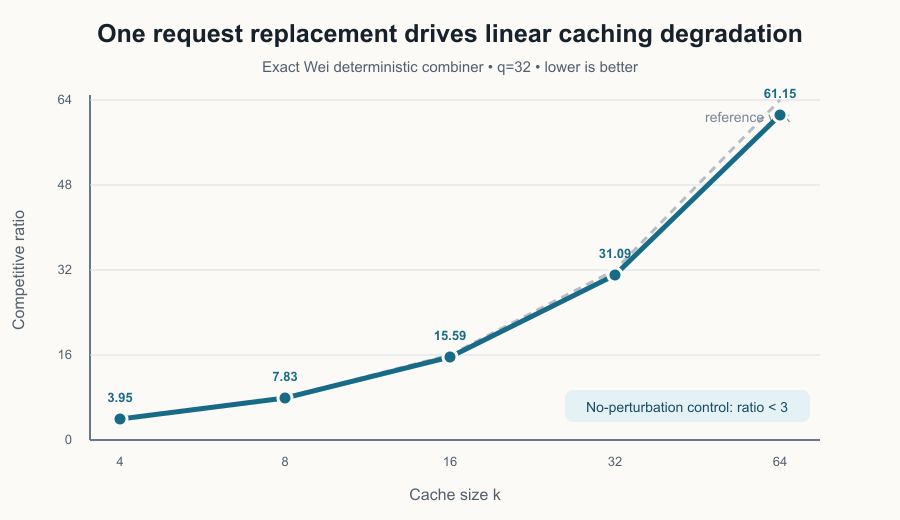
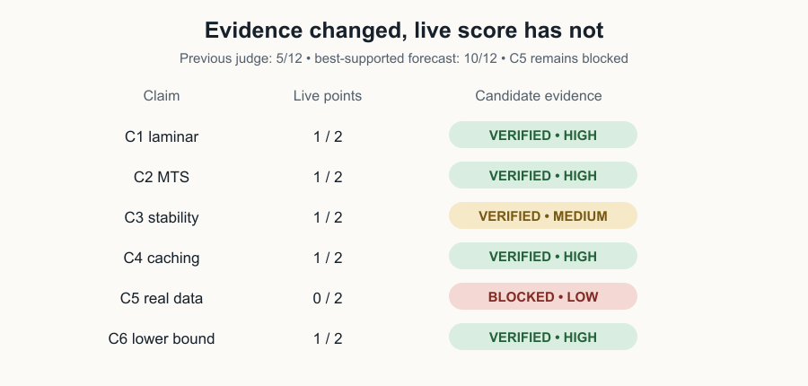
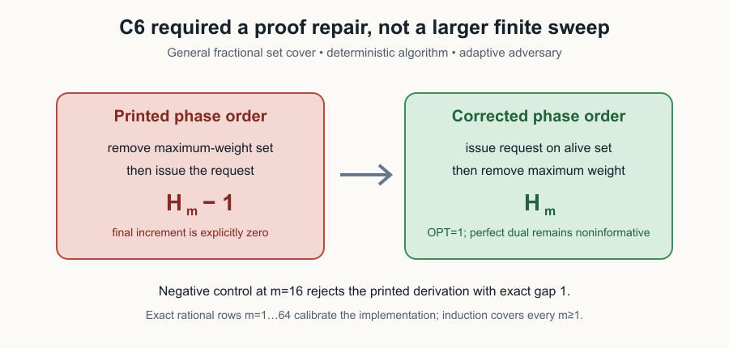
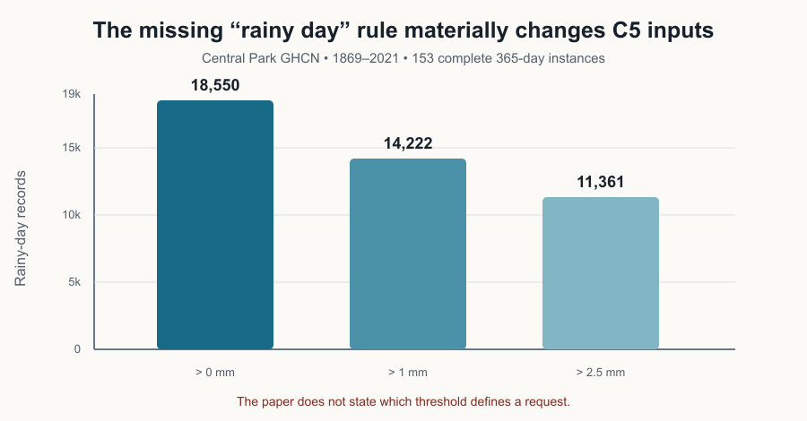

# Reproducing Dual-Prediction Online Minimization: Five Proof-Level Results and One Honest Blocker



This paper asks whether an online minimization algorithm can profit from a
prediction of an optimal **dual** solution without becoming fragile when that
prediction is wrong. The original Space had numerical spot checks and a live
judge score of 5/12. This campaign replaced those checks with exact symbolic
certificates or parametric constructions for five claims. The sixth—the
real-data experiment—remains blocked because the released paper does not
identify a unique executable pipeline.

## What was implemented

One fixed command drives every experiment:

```text
uv run --frozen python repro/src/run_publication_gate.py
```

The repository uses Python 3.12, one repository `.venv`, and a dependency-free
`uv.lock`. Every current verifier fails closed, has an independent checker,
and runs a control that must be rejected. Cumulative runs also execute the
historical finite checks so prior evidence does not silently regress.



The live score remains 5/12. A conservative forecast is 8/12–10/12, with
10/12 the best-supported possible score—not a judge result. C1, C2, C4, and C6
have HIGH confidence; C3 is MEDIUM because the appendix contains a notation
defect that the current contract resolves explicitly; C5 is LOW and BLOCKED.

## The strongest experimental result: caching instability

The paper argues that replacing one request can leave a stale page in
BlindOracle and make Wei’s learning-augmented caching algorithm perform like a
classical algorithm. The prose skips a necessary step: Wei’s black-box theorem
is an upper bound relative to the better expert, not a lower-bound transfer.

We therefore implemented the named deterministic combiner itself. It simulates
BlindOracle and LRU, follows the lower-cost expert, and maintains its own cache.
True and anticipated sequences differ at exactly one request; this affects two
next-arrival records. Across `k=4,8,16,32,64`, the ratio grows from 3.95 to
61.15. The minimum ratio divided by `k` over the last three points is 0.955.
With no replacement, the negative-control ratio is below 3.

This directly verifies an `Omega(k)` deterioration for Wei’s deterministic
instantiation, which implies the paper’s weaker `Omega(log k)` conclusion. It
does not claim to reconstruct the randomized combiner.

## Universal claims: certificates instead of sampled instances

C2 has the cleanest proof object. An exact-rational Farkas certificate combines
the algorithm’s upper bound, the offline path’s lower bound, and the span-error
definition into `ALG - OPT - ETA <= 0`. A base case and symbolic
`T -> T+1` step certify telescoping for arbitrary finite horizons. The ratio is
asserted only for `OPT>0`.

C1 reconstructs both laminar charging arguments and performs the exact
`alpha=1/(1+epsilon)` substitution. C3 checks the stability proof cone,
triangle induction over the symmetric difference, and the unbounded parametric
primal family. It rejects the appendix’s undefined `2 alpha` restatement in
favor of the main theorem’s `2 beta`.

C6 exposed a more substantive defect:



The manuscript’s remove-before-request order sums to `H_m-1`, and its final
increment is zero. Requesting the element on the current alive set *before*
removing a maximum-weight set restores the standard `H_m` adversary while
preserving every stated assumption. The perfect dual prediction remains
constant and noninformative.

## Why the real-data claim is blocked

The four source figures are internally consistent with the prose, but that is
circular evidence. A full primary-data audit downloaded and hashed the Central
Park GHCN station record, reconstructing all 153 named years. It also resolved
the official Citi Bike manifest: 25 archives totaling 19.20 GB for 2023–2025.



The missing rainy-day threshold alone changes the PPP request count by more
than 7,000. The paper also omits the exact PPP baselines, interval alignment,
Manhattan predicate, latitude endpoints, initial server configurations,
configuration multiplicity, WFA/DC tie rules, dual/request alignment, and
random seeds. Downloading the 19.20 GB of trips cannot determine those
semantics.

Four materially different routes were completed: source-artifact consistency,
full GHCN reconstruction, Citi Bike manifest/method audit, and a dedicated
falsification search. No assumption-satisfying counterexample was found.
Accordingly, C5 is BLOCKED—not verified, falsified, skipped, or approximated.

## Assessment

The evidence supports five current candidate verdicts: C1 VERIFIED, C2
VERIFIED, C3 VERIFIED, C4 VERIFIED, and C6 VERIFIED. C5 remains BLOCKED until
the author experiment revision, processed inputs, initial configurations, tie
rules, and seeds are released.

Important experiment branches:

- `orx/exact-theory-contracts-and-proof-certificates` — exact C2 proof.
- `orx/remaining-universal-theory-certificates` — C1, C3, and repaired C6.
- `orx/exact-caching-combiner-instability` — direct C4 implementation.
- `orx/correct-ghcn-unit-sensitivity` — corrected four-route C5 audit.

The detailed machine-readable run lineage is in
`candidate/evidence/runs/experiment-tree.json`.
